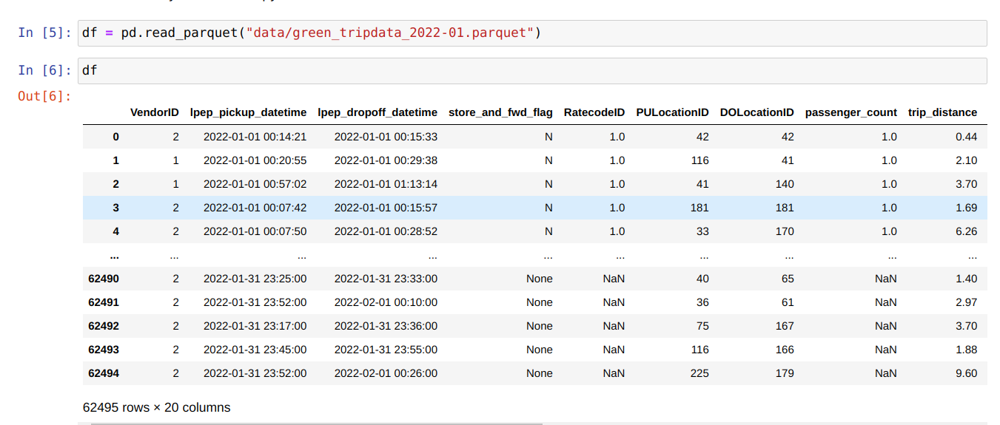

# Ride Trip Duration Prediction Streaming App using AWS Lambda and Kinesis

## App Details

- **Trip Duration Prediction**
- **Data:** NYC Green Trip Data (January, February 2022)
- **Features Used for Training:** PickUp location, DropOff Location, trip_distance, PU_DO (DictVectorizer used to map features to vectors)
- **Model Details:**
  - **S3 Path:** `s3://mlflow-nyc-taxi-reg-exp/4/def558fd38f44d8e9c4fc632668d3a47/artifacts/model`
  - **Model Type:** RandomForestRegressor
  - **Implementation:** Python
  - **Parameters:** max_depth=20, min_samples_leaf=10, n_estimators=100, random_state=0, rmse=6.101
  - **Experiment Tracking:** mlflow

## About the Project

The Lambda function `ride_duration_prediction` prepares features from a JSON input event, fetches the model from S3, and predicts the trip duration using the model. The Lambda function is containerized using Docker, and the image is published on the ECR registry. Event data is put onto the `ride_events` Kinesis data stream as JSON, and the predictions are fetched by the `ride_prediction` Kinesis data stream using the `get_record` method in AWS CLI.

## Steps to Create the Streaming App

1. **Create IAM Role and Set Permissions:**
   - **Role Name:** `lambda-kinesis-role`
   - **Trusted Entity:** Lambda
   - **Permissions:** `awslambdakinesisexecutionrole`

2. **Starting with Lambda to Ensure Output on an Event Test:**
   - **Create a Test Lambda Function:** `ride-duration-prediction-function`
   - **Runtime:** Python 3.9
   - **Role:** `lambda-kinesis-role`
   - **Function Code:**
     ```python
     import json

     def lambda_handler(event, context):
         # TODO implement
         print(json.dumps(event))
         return {
             'statusCode': 200,
             'body': json.dumps('Hello from Lambda!')
         }
     ```

3. **Improve Lambda Function by Adding `prepare_features` and `predict_features` Functions and Configure Test Event with a Basic Ride Event (JSON):**
   - **Function Code:**
     ```python
     import json

     def prepare_features(ride):
         features = {}
         features['PU_DO'] = '%s_%s' % (ride["PULocationID"], ride["DOLocationID"])
         features['trip_distance'] = ride["trip_distance"]
         return features

     def predict(features):
         return 10.0

     def lambda_handler(event, context):
         ride = event['ride']
         ride_id = event['ride_id']
         features = prepare_features(ride)
         predictions = predict(features)
         
         return {
             'ride_duration': predictions,
             'ride_id': ride_id
         }
     ```
   - **Event Test Data:**
     ```json
     {
       "ride": {
         "PULocationID": 130,
         "DOLocationID": 205,
         "trip_distance": 3.66
       },
       "ride_id": 123
     }
     ```


4. **Check Kinesis Stream Event Format:**
    - Check the format of Kinesis stream events by putting a basic test event using AWS CLI and reading the CloudWatch logs of the AWS Lambda function.

    **Function Code (with edits):**
    ```python
    import json

    def prepare_features(ride):
        features = {}
        features['PU_DO'] = '%s_%s' % (ride["PULocationID"], ride["DOLocationID"])
        features['trip_distance'] = ride["trip_distance"]
        return features

    def predict(features):
        return 10.0

    def lambda_handler(event, context):
        #ride = event['ride']
        #ride_id = event['ride_id']
        #features = prepare_features(ride)
        #predictions = predict(features)
        
        print(json.dumps(event))
        predictions = 10.0 
        
        return {
            'ride_duration': predictions,
            'ride_id': ride_id
        }
    ```

    **Steps:**
    - Create Kinesis stream `ride_events` (data stream, provisioned mode, 1 shard).
    - At Lambda, add a trigger for Kinesis stream `ride_events`.
    - Configure AWS CLI for IAM user with access keys and secret key (output format=text).
    - Create a test event and send it through the terminal:

    ```bash
    aws kinesis put-record \
        --stream-name ride_events \
        --partition-key 1 \
        --data "Hi test 1" \
        --cli-binary-format raw-in-base64-out
    ```

    - In AWS terminal, obtain the shard details.
    - Lambda will consume this from streams, and it will be reflected in the logs.
    - Check Lambda monitor logs in CloudWatch for the event structure.

    **Obtained Event Structure:**
    ```json
    {
        "Records": [
            {
                "kinesis": {
                    "kinesisSchemaVersion": "1.0",
                    "partitionKey": "1",
                    "sequenceNumber": "49639854210870046278837730611666112709822541697829044226",
                    "data": "SGkgdGVzdCAx",
                    "approximateArrivalTimestamp": 1681551089.843
                },
                "eventSource": "aws:kinesis",
                "eventVersion": "1.0",
                "eventID": "shardId-000000000000:49639854210870046278837730611666112709822541697829044226",
                "eventName": "aws:kinesis:record",
                "invokeIdentityArn": "arn:aws:iam::938316853267:role/lambda-kinesis-role",
                "awsRegion": "us-east-1",
                "eventSourceARN": "arn:aws:kinesis:us-east-1:938316853267:stream/ride_events"
            }
        ]
    }
    ```

    **To Decode the Event Data Using Base64, Modify the Lambda Function:**

    **Function Code:**
    ```python
    import base64

    def lambda_handler(event, context):
        for record in event['Records']:
            encoded_data = record['kinesis']['data']
            decoded_data = base64.b64decode(encoded_data).decode('utf-8')
            print(decoded_data)
    ```

    - Now, edit the test, create a new test, and paste the event with encoded text to check if it gives the decoded output.

5. **Deploy and Test Sending Ride Record:**

    - At AWS CLI:

    ```bash
    aws kinesis put-record \
        --stream-name ride_events \
        --partition-key 1 \
        --cli-binary-format raw-in-base64-out \
        --data '{
      "ride": {
        "PULocationID": 130,
        "DOLocationID": 205,
        "trip_distance": 3.66
      },
      "ride_id": 123
    }'
    ```

    **Event Config from AWS Lambda Log:**
    ```json
    {
        "Records": [
            {
                "kinesis": {
                    "kinesisSchemaVersion": "1.0",
                    "partitionKey": "1",
                    "sequenceNumber": "49639854210870046278837730620094743524175848591505489922",
                    "data": "ewogICJyaWRlIjogewogICAgIlBVTG9jYXRpb25JRCI6IDEzMCwKICAgICJET0xvY2F0aW9uSUQiOiAyMDUsCiAgICAidHJpcF9kaXN0YW5jZSI6IDMuNjYKICB9LAogICJyaWRlX2lkIjogMTIzCn0K",
                    "approximateArrivalTimestamp": 1681552724.5
                },
                "eventSource": "aws:kinesis",
                "eventVersion": "1.0",
                "eventID": "shardId-000000000000:49639854210870046278837730620094743524175848591505489922",
                "eventName": "aws:kinesis:record",
                "invokeIdentityArn": "arn:aws:iam::938316853267:role/lambda-kinesis-role",
                "awsRegion": "us-east-1",
                "eventSourceARN": "arn:aws:kinesis:us-east-1:938316853267:stream/ride_events"
            }
        ]
    }
    ```

    - Now decode the ride data with the Lambda function.


6. **Creating the Kinesis Stream to Consume the Prediction Outputs**

    - Create the stream `ride_prediction`.

    **Modified Lambda Function:**
    ```python
    import boto3
    import json
    import os

    kinesis_client = boto3.client('kinesis')
    prediction_events = []
    PREDICTIONS_STREAM_NAME = os.getenv('PREDICTIONS_STREAM_NAME', 'ride_prediction')

    def lambda_handler(event, context):
        # Process event and make prediction
        ride_id = event['ride_id']
        prediction_event = {
            'ride_id': ride_id,
            'prediction': 10.0  # This should be replaced with actual prediction logic
        }
        
        kinesis_client.put_record(
            StreamName=PREDICTIONS_STREAM_NAME,
            Data=json.dumps(prediction_event),
            PartitionKey=str(ride_id)
        )
    ```

    - Attach a policy to `lambda-kinesis` role to provide `putRecord` permission to Lambda:
      - Create a policy in IAM with permission for Kinesis service action `write-putrecord` on the stream ARN for `ride_predictions`.

    **To Get Records from `ride_prediction` Stream at AWS CLI:**

    ```bash
    export KINESIS_STREAM_OUTPUT='ride_prediction'
    export SHARD='shardId-000000000000'
    export SHARD_ITERATOR=$(aws kinesis \
        get-shard-iterator \
        --shard-id ${SHARD} \
        --shard-iterator-type TRIM_HORIZON \
        --stream-name ${KINESIS_STREAM_OUTPUT} \
        --query 'ShardIterator'
    )

    echo $SHARD_ITERATOR

    export RESULT=$(aws kinesis get-records --shard-iterator $SHARD_ITERATOR --output json)

    echo $RESULT

    # To install jq (JSON processor)
    apt-get install jq

    # Decode and parse the data
    echo ${RESULT} | jq -r '.Records[0].Data' | base64 --decode | jq
    ```

7. **Adding Model to Lambda Function**

    - Edit the Lambda function locally to add model details.

    **Lambda Function Code:**
    ```python
    import boto3
    import json
    import os
    import mlflow

    kinesis_client = boto3.client('kinesis')
    PREDICTIONS_STREAM_NAME = os.getenv('PREDICTIONS_STREAM_NAME', 'ride_prediction')
    TEST_RUN = os.getenv('TEST_RUN', 'False') == 'True'

    # Load your model
    model = mlflow.pyfunc.load_model('path_to_your_model')

    def lambda_handler(event, context):
        for record in event['Records']:
            encoded_data = record['kinesis']['data']
            decoded_data = base64.b64decode(encoded_data).decode('utf-8')
            ride = json.loads(decoded_data)

            ride_id = ride['ride_id']
            features = prepare_features(ride['ride'])
            pred = model.predict(features)
            prediction_event = {
                'ride_id': ride_id,
                'prediction': float(pred[0])
            }
            
            if not TEST_RUN:
                kinesis_client.put_record(
                    StreamName=PREDICTIONS_STREAM_NAME,
                    Data=json.dumps(prediction_event),
                    PartitionKey=str(ride_id)
                )

    def prepare_features(ride):
        features = {}
        features['PU_DO'] = '%s_%s' % (ride["PULocationID"], ride["DOLocationID"])
        features['trip_distance'] = ride["trip_distance"]
        return features
    ```

    - Create `test.py` to test the Lambda function locally.

    **test.py:**
    ```python
    import lambda_function

    event = {
        "Records": [
            {
                "kinesis": {
                    "kinesisSchemaVersion": "1.0",
                    "partitionKey": "1",
                    "sequenceNumber": "49639854210870046278837730620094743524175848591505489922",
                    "data": "ewogICJyaWRlIjogewogICAgIlBVTG9jYXRpb25JRCI6IDEzMCwKICAgICJET0xvY2F0aW9uSUQiOiAyMDUsCiAgICAidHJpcF9kaXN0YW5jZSI6IDMuNjYKICB9LAogICJyaWRlX2lkIjogMTIzCn0K",
                    "approximateArrivalTimestamp": 1681552724.5
                },
                "eventSource": "aws:kinesis",
                "eventVersion": "1.0",
                "eventID": "shardId-000000000000:49639854210870046278837730620094743524175848591505489922",
                "eventName": "aws:kinesis:record",
                "invokeIdentityArn": "arn:aws:iam::938316853267:role/lambda-kinesis-role",
                "awsRegion": "us-east-1",
                "eventSourceARN": "arn:aws:kinesis:us-east-1:938316853267:stream/ride_events"
            }
        ]
    }

    result = lambda_function.lambda_handler(event, None)
    print(result)
    ```

    - In the terminal:
    ```bash
    cd to_folder_containing_lambda_function
    pipenv shell
    python3 test.py
    ```

    **To run the test with environment variables:**
    ```bash
    export PREDICTIONS_STREAM_NAME='ride_prediction'
    export RUN_ID='def558fd38f44d8e9c4fc632668d3a47'
    export TEST_RUN="True"

    python3 test.py
    ```


### 8. Packaging to a Docker Container

1. **Install Required Packages:**

    ```bash
    pipenv install boto3 mlflow scikit-learn --python=3.9
    ```

2. **Create Dockerfile:**

    Search for 'aws ecr registry' and find the lambda python 3.9 image tag. Use this image tag in the Dockerfile.

    **Dockerfile:**
    ```Dockerfile
    FROM public.ecr.aws/lambda/python:3.9

    RUN pip install -U pip
    RUN pip install pipenv

    COPY ["Pipfile", "Pipfile.lock", "./"]

    RUN pipenv install --system --deploy

    COPY ["lambda_function", "./"]
    CMD ["lambda_function.lambda_handler"]
    ```

3. **Build and Run the Docker Image:**

    - Navigate to the folder containing `lambda_function`, `Dockerfile`, `Pipfile`, etc.
    
    - Build the Docker image:
      ```bash
      docker build -t stream-model-duration:v1 .
      ```

    - Run the Docker container:
      ```bash
      docker run -it --rm \
          -p 8080:8080 \
          -e PREDICTIONS_STREAM_NAME="ride_prediction" \
          -e RUN_ID='def558fd38f44d8e9c4fc632668d3a47' \
          -e TEST_RUN="True" \
          -e AWS_ACCESS_KEY_ID="**********************" \
          -e AWS_SECRET_ACCESS_KEY="**************************" \
          -e AWS_DEFAULT_REGION="us-east-1" \
          stream-model-duration:v1
      ```

4. **Create Requests to Test Docker Image:**

    **test_docker.py:**
    ```python
    import requests

    event = {
        "Records": [
            {
                "kinesis": {
                    "kinesisSchemaVersion": "1.0",
                    "partitionKey": "1",
                    "sequenceNumber": "49639854210870046278837730620094743524175848591505489922",
                    "data": "ewogICJyaWRlIjogewogICAgIlBVTG9jYXRpb25JRCI6IDEzMCwKICAgICJET0xvY2F0aW9uSUQiOiAyMDUsCiAgICAidHJpcF9kaXN0YW5jZSI6IDMuNjYKICB9LAogICJyaWRlX2lkIjogMTIzCn0K",
                    "approximateArrivalTimestamp": 1681552724.5
                },
                "eventSource": "aws:kinesis",
                "eventVersion": "1.0",
                "eventID": "shardId-000000000000:49639854210870046278837730620094743524175848591505489922",
                "eventName": "aws:kinesis:record",
                "invokeIdentityArn": "arn:aws:iam::938316853267:role/lambda-kinesis-role",
                "awsRegion": "us-east-1",
                "eventSourceARN": "arn:aws:kinesis:us-east-1:938316853267:stream/ride_events"
            }
        ]
    }

    url = 'http://localhost:8080/2015-03-31/functions/function/invocations'
    response = requests.post(url, json=event)
    print(response.json())
    ```

    - Run the test:
      ```bash
      cd to_folder_containing_lambda_function
      pipenv shell
      python3 test_docker.py
      ```

5. **Useful Docker and Pipenv Commands:**

    ```bash
    # Docker commands
    docker ps
    docker kill <container_id>
    docker image rm stream-model-duration:v1

    # Pipenv commands
    pipenv --rm
    rm Pipfile.lock
    pipenv install
    ```

    Reference: [Aripalo Blog on AWS Lambda Container Image Support](https://aripalo.com/blog/2020/aws-lambda-container-image-support/)

### 9. Publish to ECR (Docker Registry)

1. **Create ECR Repository:**

    ```bash
    aws ecr create-repository --repository-name duration-pred-model
    ```

    - Get the repository URI from the command output:
      `<user>.dkr.ecr.<region>.amazonaws.com/duration-pred-model`

2. **Authenticate Docker with ECR:**

    ```bash
    aws ecr get-login-password --region <region> | docker login --username AWS --password-stdin <user>.dkr.ecr.<region>.amazonaws.com/
    ```

3. **Tag and Push Docker Image:**

    ```bash
    export REMOTE_URI="<user>.dkr.ecr.<region>.amazonaws.com/duration-pred-model"
    export REMOTE_TAG='v1'
    export REMOTE_IMAGE=${REMOTE_URI}:${REMOTE_TAG}
    export LOCAL_IMAGE="stream-model-duration:v1"

    docker tag ${LOCAL_IMAGE} ${REMOTE_IMAGE}
    docker push ${REMOTE_IMAGE}

    echo $REMOTE_IMAGE
    # Output: <user>.dkr.ecr.<region>.amazonaws.com/duration-pred-model:v1
    ```

4. **Use This Image to Create the New AWS Lambda Function**

### 10. Updating the AWS Lambda Function

1. **Create a New Function Using the Container Image:**

    - Use the container image URI.
    - Provide the Lambda Kinesis role.

2. **Configure the Function:**

    - Add environment variables: `PREDICTIONS_STREAM_NAME`, `RUN_ID`.
    - Add trigger: Kinesis - `ride_events`.

3. **Send Event and View Logs:**

    - Send event through the terminal:
      ```bash
      aws kinesis put-record ...
      ```
    - View logs in Lambda.

4. **Attach Policy for Reading S3 Bucket to Lambda-Kinesis Role:**

    - IAM role: Add permission to attach policy for S3 read and list permissions.
    - Resources: Specify the bucket name to be read from (`object-b name, *` for object name).

5. **Test with Event Using `test_docker.py`:**

    - Configure Lambda: Edit basic settings (256/512MB memory, 15s timeout).

6. **Send Event Record Through `ride_events` Stream:**

    - Send event:
      ```bash
      aws kinesis put_record ...
      ```
    - Receive the predictions from `ride_prediction` stream online:
      ```bash
      aws kinesis get_record ...
      ```

Images from the Project Implementation:

Data (Structure)


Kinesis event put record with input features


Kinesis event get record with predicted results
